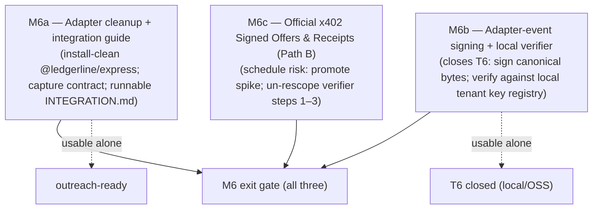

# Ledgerline Milestone 6 — Protocol credibility + a secure, framework-clean adapter

**Implementation PLAN (approve before coding). Technical-only and public-safe — primitives, formats,
and a reference implementation; no hosted/commercial surface (that is M7, private — see
`COMMERCIAL_BOUNDARY.md`).**

## Context

`v0.1.0` (M0–M5) is the live, frozen grant demo: a paid `$0.003` x402 / Circle Gateway call →
recognized revenue → balanced double-entry ledger → keccak256 + RFC-9162 Merkle batch anchored and
verified on Arc Testnet, with CI green. It ships on **Path C** — the Ledgerline receipt analog
(D-0001), not an official x402 Signed Receipt.

M6 is the **OSS credibility-hardening pass**: it strengthens the proof story and makes the
open-source adapter feel installable, **without building any hosted/commercial surface** (that is M7,
which lives in the private `ledgerline-cloud` repo — see `COMMERCIAL_BOUNDARY.md`). M6 publishes
*primitives, formats, and a reference implementation*; it does not build operations.

It closes the two most visible gaps in the current demo:

1. **Path C, not official receipts.** The verifier's steps 1–3 are re-scoped / `na` under Path C
   (`packages/anchor/src/index.ts:430–435`). Official x402 Signed Offers/Receipts make the proof chain
   `signed offer -> signed receipt -> revenue event -> split ledger -> Arc root`.
2. **T6 (adapter spoofing/forgery) is open.** `raw_events.adapter_key_id` and
   `raw_events.adapter_signature` exist (`packages/db/src/migrations/0001_init.sql:44-45`) but are
   written null and never verified. The current security suite even has a *negative* test asserting
   the gap (`packages/recognition/test/recognition.security.test.ts:144`).

M6 is split into **M6a / M6b / M6c** so the cheap parts ship for outreach even if official receipts
(the schedule risk) slip. The overall M6 exit gate requires all three; M6a/M6b are usable on their
own.



## M6a — Adapter cleanup + integration guide

**Deliverables**
- `@ledgerline/seller-client` is already framework-agnostic (its header says so); make
  `@ledgerline/express` install-clean and document the capture contract (the `raw_events` shape it
  writes) so a new framework adapter is a thin shell over the shared capture core.
- Rewrite/extend `docs/INTEGRATION.md` to answer, copy-paste runnable: "I have an x402 endpoint —
  what do I install, where do I mount it, what tables does it write, how do I export and verify?"

**Exit gate:** a developer who is not us follows the guide on a fresh checkout and goes
capture → recognize → verify in under a day.

## M6b — Adapter-event signing + verification (closes T6)

**Deliverables**
- Define the **adapter event signing envelope**: the adapter signs the canonical bytes of the
  normalized event with a per-tenant adapter key and emits `adapter_key_id` + `adapter_signature`
  (the columns already exist).
- **Local reference verifier**: the recognition pipeline verifies the signature against a
  **configured local tenant key registry** before recognizing. A forged/unsigned event is rejected.
- **The real work in T6 is key lifecycle** — generation, configuration/distribution, rotation,
  revocation — *not* the signature math. Scope M6b to the lifecycle for the local/OSS case (a config
  file / env-provided registry). The *operated* key registry and a tenant-scoped verification
  *service* are explicitly M7 (private) per `COMMERCIAL_BOUNDARY.md`.
- Reuse: this is the same envelope `ledgerline-cloud`'s hosted `POST /v1/events` will verify in M7 —
  the public package is the contract, the cloud consumes it (never the reverse).

**Precision (do not overclaim):** there is no hosted server boundary in M6. M6b verifies in-pipeline
against a configured registry and *prepares* the envelope; API-key and tenant-auth *enforcement*
arrive only with M7.

**Exit gate:** the existing T6 negative test flips to a positive control — a signed event recognizes,
an unsigned/forged or wrong-key event is rejected; key rotation/revocation works against the local
registry.

## M6c — Official x402 Signed Offers & Receipts, Path B  (schedule risk inside M6)

**Deliverables**
- Promote the kept spike (`apps/spike-receipt/`, which **proved Path B achievable** — D-0001) into
  the demo path: produce + independently verify the official EIP-712 Signed Offer (on `402`) and
  Signed Receipt (on `200`) via `@x402/extensions` `offer-receipt` on an `x402ResourceServer` wired
  to Circle's `BatchFacilitatorClient` / `GatewayEvmScheme`, using a **dedicated signing key distinct
  from the payment address** (spec requirement).
- Capture the official artifacts into `x402_payment_artifacts` (alongside / replacing the Path-C
  `payment_signature` analog) and commit their hashes.
- **Un-rescope the verifier:** turn steps 1–3 from Path-C placeholders into real checks —
  step 1 "official Signed Receipt present", step 2 "receipt signature valid (EIP-712)", step 3
  "receipt matches offer (terms/amount bind)" (`packages/anchor/src/index.ts:430–435`). Drop the
  "receipt analog" qualifier and the no-overclaim hedge **only where the official artifact is
  captured end-to-end**.

**Known wrinkle (from the spike / D-0001):** pin `@x402/core` to the version Circle's
`@circle-fin/x402-batching` was built against (a known type-skew). Resolve this in M6c, not later.

**De-risked, not eliminated:** the spike proved the artifact can be *produced and verified*; wiring it
into the *live* middleware path (Path A on the same ResourceServer vs Path B parallel server alongside
Circle's middleware) is the residual integration risk — hence the M6a/M6b/M6c split.

**Do this first inside M6c — a capture-test spike plan** with explicit, runnable assertions:

```text
offer captured from the 402 response
receipt captured from the 200 response
receipt verifies (EIP-712 signature valid; dedicated signing key, not the payment address)
receipt matches the offer (terms / amount bind)
revenue event ties to the signed-offer amount
Arc proof includes the official artifact hash
```

**Exit gate:** the six assertions above pass end-to-end; verifier steps 1–3 are real (no longer
`na`); no-overclaim qualifier removed where the official artifact exists.

## (Optional, partner-pulled — NOT on-spec) First non-JS path

Only if the first design partner is Python/FastAPI. x402 supports FastAPI/Flask natively, but Circle
Gateway Nanopayments is JS-first (`createGatewayMiddleware` / `BatchFacilitatorClient` are TS), so
decide deliberately among: (A) native Python capture, (B) a language-neutral event emitter to the
(M7) hosted API, (C) a local Node sidecar, (D) full Circle Gateway in Python — do **not** promise (D)
untested. This is documented here only so it is not mistaken for on-spec M6 work.

## Critical files (for the eventual implementation)

- `packages/seller-client/src/index.ts` — capture core; add event-signing (M6b). Already
  framework-agnostic; the `canonicalHash`/serializer is an M0 placeholder (separate from the M4
  `@ledgerline/canonical` LCJ used for committed leaves — leave that distinction intact).
- `packages/express/src/*` — adapter cleanup (M6a); sign before write (M6b).
- `packages/recognition/src/index.ts` — verify adapter signature on ingest against the configured
  registry (M6b).
- `packages/anchor/src/index.ts:430–435` — un-rescope verifier steps 1–3 (M6c).
- `apps/spike-receipt/` — the M6c foundation (promote to the demo path); resolve the `@x402/core` pin.
- `packages/db/src/migrations/` — `adapter_key_id`/`adapter_signature` already exist (no schema add
  needed for T6); the official-artifact capture may need an `x402_payment_artifacts.artifact_type`
  value/columns review (the table is defined in `0003_revenue_recognition.sql`).
- `docs/INTEGRATION.md` — rewrite (M6a). Threat model `docs/THREAT_MODEL.md` — flip T6 to TESTED, and
  T4 from PARTIAL toward ENFORCED, once M6b/M6c land.

## Verification (when M6 is built)

- `pnpm typecheck` 9/9, `pnpm test` green (+ new M6b signing tests, T6 positive control),
  `pnpm test:security` green, `pnpm vectors:check` OK, `pnpm contracts:test` unchanged.
- M6c capture-test spike: the six assertions above pass; `pnpm verify` shows steps 1–3 as real
  passes, not `na`.
- A fresh-clone integration-guide walkthrough succeeds (M6a exit gate).
- No public copy claims official-receipt support except where the artifact is captured end-to-end.

## Out of scope for M6 (deferred to M7 / private `ledgerline-cloud`)

Hosted `POST /v1/events`, API-key management, tenant-auth enforcement, the operated key registry +
key-rotation/revocation *service*, KMS metadata encryption, the hosted dashboard / supplier portal.
M6 builds the public primitives those consume; it does not build the operated services.
